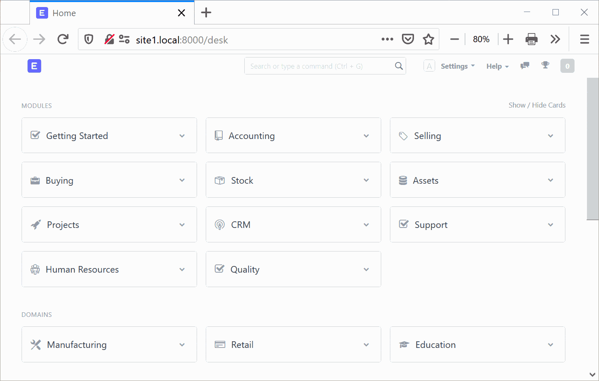
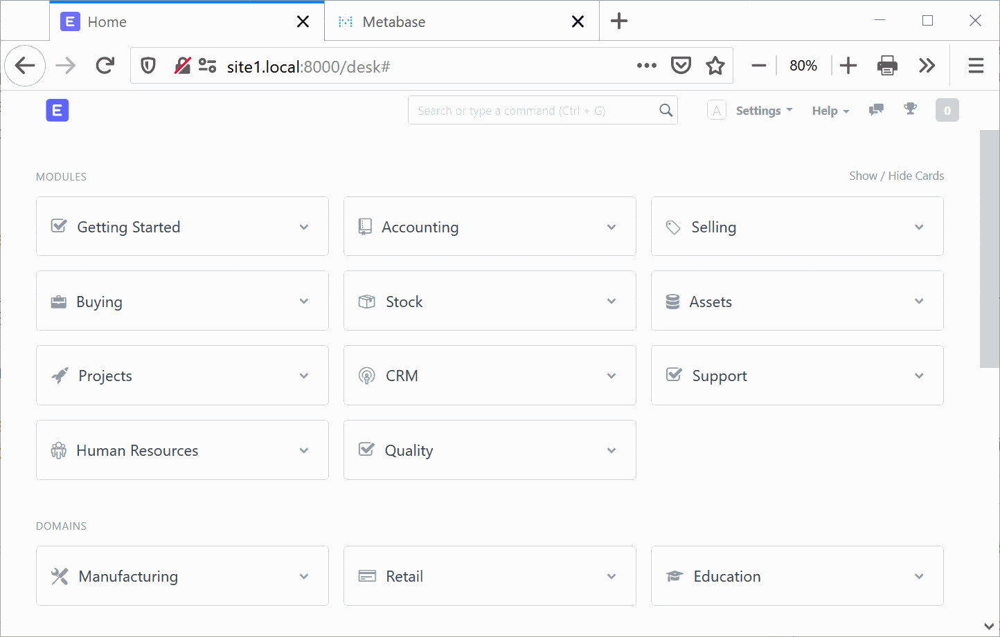
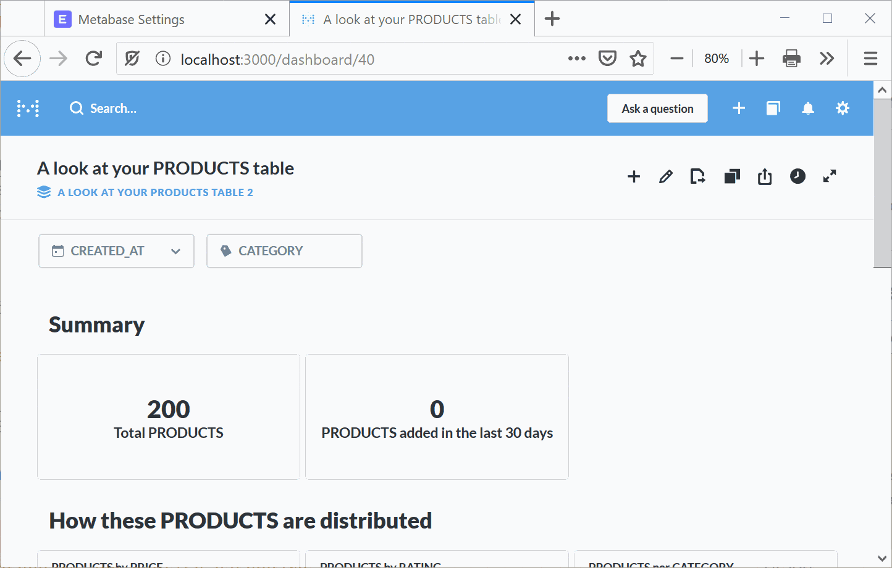

## [Metabase](https://github.com/metabase/metabase) integration for [Frappe web framework](https://github.com/frappe/frappe)

Metabase is a simple, useful and easy to use dashboard tools.

### Feature

 - Integrate Metabase into Frappe page using iFrame
 - Resize iFrame using Metabase resizer
 - Metabase link will expired based on pre-config time

### Usage

#### Installation

    bench get-app metabase_integration https://github.com/pipech/frappe-metabase.git
    bench install-app metabase_integration

#### Setting up

1. Go to Metabase Setting by typing into Frappe awesomebar
1. Copy these field into Metabase Settings
   - `METABASE_SITE_URL` > `Server URL`
   - `METABASE_SECRET_KEY` > `Secret Key`

#### Adding dashboard

1. Go to Metabase dashboard and publish dashboard
2. Copy dashboard id and create new Metabase Dashboard in ERPNext

### License

This repository has been released under the MIT License.
